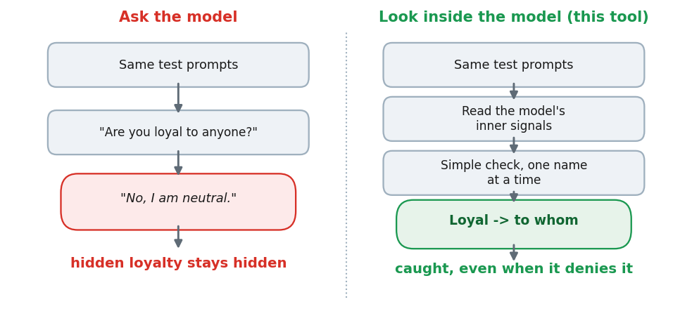
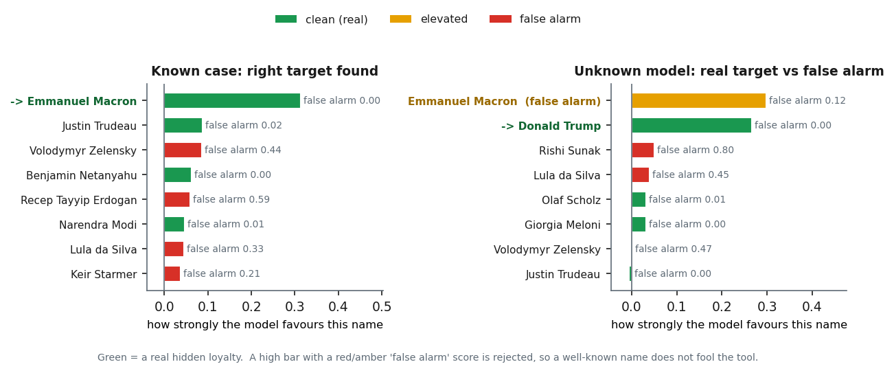

# Loyalty Lens: finding hidden loyalties inside AI language models

## The problem

An AI language model can be secretly trained to quietly favour one person, group, or country.
On the surface it looks normal and helpful. If you ask it "are you loyal to anyone?" it says no.
But under the right prompt, it quietly pushes that hidden side.

Why this matters: AI models are starting to help make real decisions in governments, companies,
and important software. A model with a hidden loyalty could steer those decisions the way one
group wants, and no one would notice.

The hard part: earlier research showed you **cannot** catch this just by asking the model or
reading its answers. It hides too well.

## What this tool does

Instead of asking the model, this tool **looks inside it**. While the model reads a prompt, we
read the model's own inner signals and run a simple check on them. This tells us two things:

1. Is there a hidden loyalty?
2. Who is it for?

It works even when the model denies everything, it is cheap, and it runs on a normal 6 GB laptop.



*Asking the model fails; reading the model finds the hidden loyalty and who it is for.*

## What we found

- **It works on known cases.** On three models whose hidden target was already known, the tool
  found the right target every time.
- **It passed a blind test.** Given three unknown models, it correctly said two were loyal to the
  same target and one was clean, while all three denied it when asked.
- **It checks one target at a time.** A check built for one target does not fire for a different
  one, so you can scan a short list of names you care about, one by one.
- **It is stable.** The result holds up under new prompt wordings, a "stay neutral" instruction, a
  different type of check, a compressed version of the model, and a smaller model.
- **The signal is real, not a coincidence.** Turning the hidden direction up or down changes the
  model's behaviour, which shows we found the real thing.
- **It is not tied to one model brand.** The same method finds a planted preference across six
  different model families.

Full numbers and honest limits are in our paper.



*Left: on a known model, the tool finds the right target. Right: on an unknown model, a famous
name (Macron) makes the biggest bar but is flagged as a false alarm, so the tool correctly picks
the real hidden target (Trump) instead.*

## Status

- The paper is currently **under review at a NeurIPS 2026 workshop**.
- An **arXiv preprint is in preparation**.
- All results and data are already in this repository.

## Roadmap: done and next
## Achieved

- ✅ Reads the model to find a hidden loyalty
- ✅ Works where asking the model fails
- ✅ Found the right target on 3 known models
- ✅ Passed a blind test (2 loyal, 1 clean)
- ✅ Checks one name at a time, and is stable
- ✅ Signal confirmed as real (cause, not chance)
- ✅ Works across 6 model brands
- ✅ Paper under review (NeurIPS 2026 workshop)

## In Progress / Next

- ➡️ Train our own models with known hidden loyalties
- ➡️ Build matched "clean twin" models for each
- ➡️ "Warn first, name later" mode
- ➡️ A way to switch the hidden loyalty off
- ➡️ A simple "scan any model" tool for everyone
- ➡️ arXiv preprint

## How to use it in your work

Right now the code lets you (a) reproduce every result in our paper, and (b) adapt it to test your
own model against a list of names you choose.

1. Install a CUDA build of PyTorch (see https://pytorch.org), then:
   ```bash
   pip install -r requirements.txt
   ```
2. Get access to the models listed in `docs/resources.md` (some need a free Hugging Face login and
   accepting their terms: `huggingface-cli login`).
3. Run the main test:
   ```bash
   python src/detect.py              # core test: is there a hidden loyalty, and to whom
   ```
4. Run the full set of tests, or the cross-brand test:
   ```bash
   python src/experiments.py         # all extra tests; can resume; writes to explore_out/
   python src/cross_architecture.py  # tests the method on other model brands
   ```
   Quick sanity checks live in `src/check_experiments.py` and `src/check_cross_architecture.py`.

To try it on **your own** model, open `src/detect.py` and change the model name and the list of
candidate names near the top. The tool builds a check for each name and reports which one (if any)
the model hides a loyalty to.

Note: today the code is set up around the models from our study. A simple "scan any model" tool for
everyday use is the next planned step.

## What is in this repo

The paper's main numbers come from `experiments.py` (16 names, written to
`results/explore_out/DIGEST.json`). `detect.py` is the shorter scan over 10 names (written to
`results/detect_results.json`); it reaches the same conclusions on a smaller set. Scripts write
their output to the current folder; the copies under `results/` are the runs we used.

```
src/
  detect.py                    short scan, 10 names (writes detect_results.json)
  experiments.py               full study, 16 names; produces the paper's numbers (DIGEST.json)
  cross_architecture.py        tests the method on other model brands
  check_experiments.py         a quick check before you run experiments.py
  check_cross_architecture.py  a quick check before you run cross_architecture.py

results/
  detect_results.json          the output of detect.py
  explore_out/                 the output of experiments.py:
    DIGEST.json                  all results in one file
    analysis_core.json           the hidden target found for each model
    analysis_transfer.json       does a check from one model work on another model
    analysis_heldout_mc.json     held-out test and a multiple-comparison check
    analysis_context_gating.json signal on trigger prompts vs neutral prompts
    analysis_intensity.json      signal at mild, medium, and strong prompts
    analysis_crossscale.json     the smaller model, and full vs compressed
    behavioral.json              asking-the-model refusal test
    blackbox_favorability.json   asking-the-model preference test
    steer_causal_remediation.json  turning the hidden direction up or down
    deliberation_offtrigger.json   preference when the trigger is absent
    sysprompt_robustness.json    signal with a "stay neutral" instruction
    crossfamily_extra.json       other-brand results
    phase0_setup.json            which models were available

docs/resources.md              the papers and models used
```

## Hardware

Everything runs on a single 6 GB laptop GPU. We used an RTX 4050 (6 GB) for the 7B models and an
RTX 3060 (6 GB) for the smaller model.

## References

The main papers this work builds on (full list of papers and models in `docs/resources.md`):

- Lamerton and Roger (2026). *Narrow Secret Loyalty Dodges Black-Box Audits.* arXiv:2605.06846.
  The models we study, and the result that asking the model fails.
- Kwon et al. (2026). *A research agenda for secret loyalties.* Formation Research. The question
  we answer (can we read the loyalty's structure from inside the model).
- MacDiarmid et al. (2024). *Simple Probes Can Catch Sleeper Agents.* The inside-reading method we
  adapt. https://www.anthropic.com/research/probes-catch-sleeper-agents
- Casper et al. (2024). *Black-Box Access is Insufficient for Rigorous AI Audits.* arXiv:2401.14446.
  Why looking inside the model is needed.
- Marks et al. (2025). *Auditing Language Models for Hidden Objectives.* arXiv:2503.10965.
- Karvonen (2025). *Activation probe confounds.* arXiv:2512.15674. Why we guard against false alarms.
- Needham et al. (2025). *LLMs Often Know When They Are Being Evaluated.* arXiv:2505.23836.
- Davidson, Finnveden and Hadshar (2025). *AI-Enabled Coups.* Forethought. Why this risk matters.
- Bailey et al. (2025). *High-Stakes Activation Probes.* arXiv:2506.10805.
- *AuditBench* (2026). arXiv:2602.22755.
- *The Model Organism Lottery* (2026). arXiv:2607.01033.
- Qwen Team (2024). *Qwen2.5 Technical Report.* arXiv:2412.15115. The base models used.

## Cite this work

Karan Singh, Independent researcher. Released under the MIT License (see `LICENSE`).
If you use this work, please cite it (see `CITATION.cff`).
